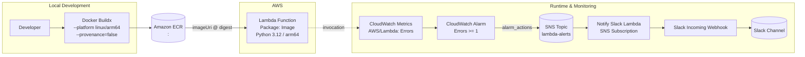

## System Architecture (Mermaid)

### Notes
- Image update: Terraform resolves ECR tag to digest (`repo@sha256:<digest>`) and updates Lambda.
- Alarm path: CloudWatch Alarm sends directly to SNS (no EventBridge / Chatbot).
- Notify Slack Lambda formats messages using Slack Block Kit and posts via Incoming Webhook.

